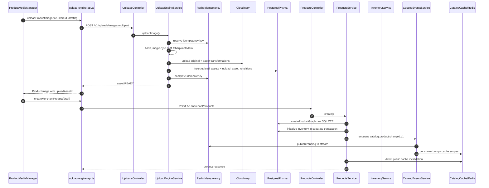
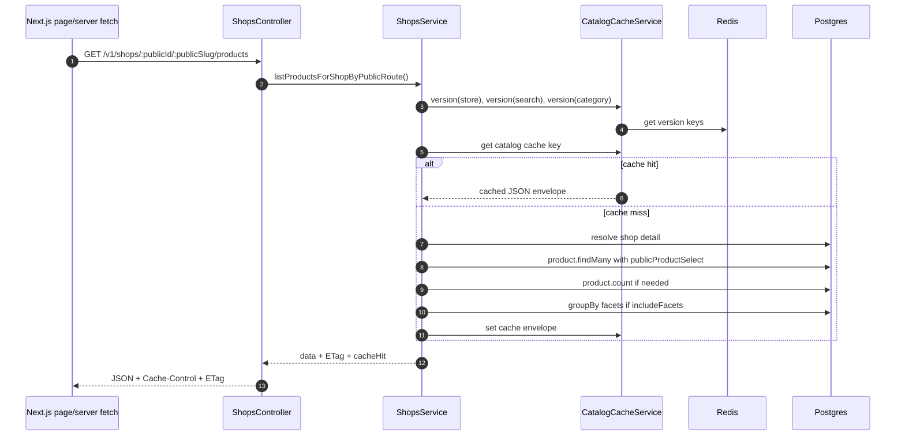
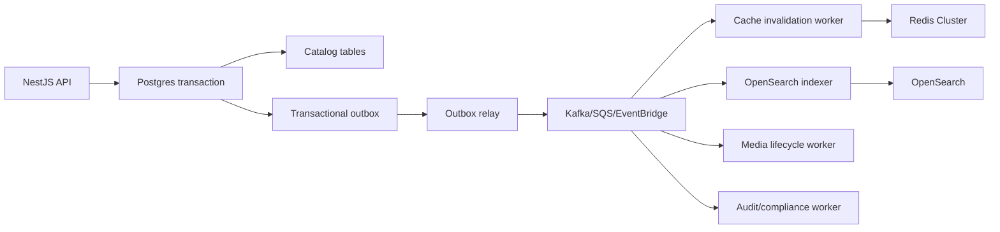
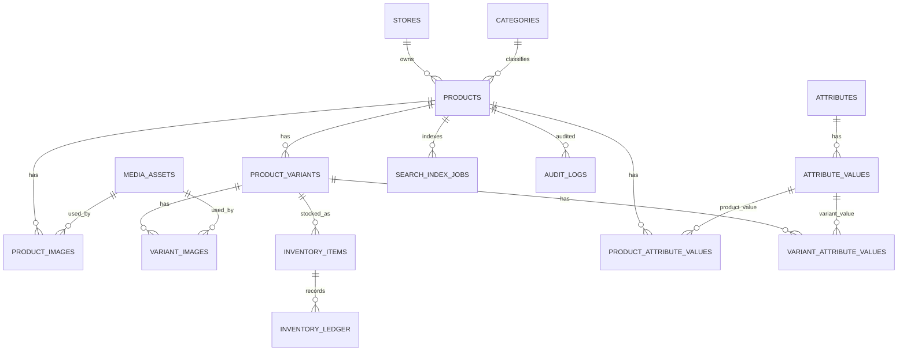
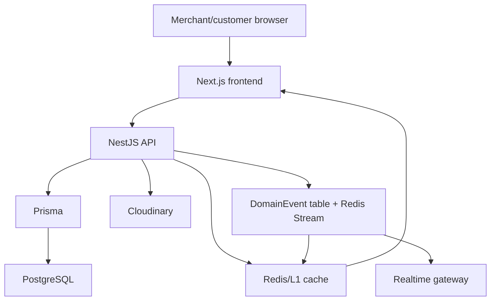
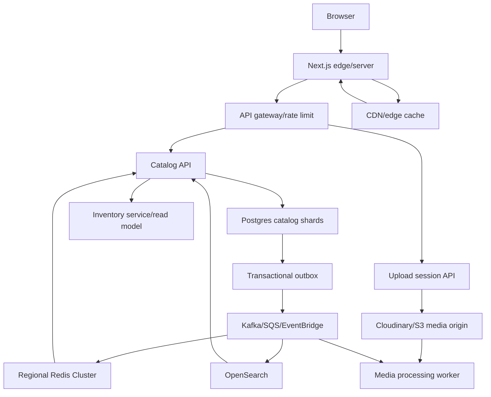

# NamaStore Product and Variant Upload System Architecture Audit

Date: 2026-06-05

Workspace: `C:\Users\Sugan001\Desktop\namastore`

Audience: pre-IPO architecture review, production scale planning, catalog platform maintainers.

Validation performed:

- Backend typecheck: `npm run typecheck` in `backend` passed.
- Frontend typecheck: `npm run typecheck` in `frontend` failed on existing recommendation DTO typing:
  - `frontend/src/app/[locale]/shop/[slug]/[shopSlug]/product/[productRef]/page.tsx:129`
  - `frontend/src/features/shops/components/shop-product-detail-view.tsx:463`
  - `frontend/src/features/shops/components/shop-product-detail-view.tsx:465`
  - `frontend/src/features/shops/components/shop-product-detail-view.tsx:582`
  - `frontend/src/features/shops/components/shop-product-detail-view.tsx:584`
  - Cause: UI reads `item.description`, but `ShopProductDetailResponse["recommendations"]` does not declare `description`.
- Focused backend tests: `npx jest --runInBand src/tests/products src/tests/uploads src/tests/shops src/tests/redis src/tests/checkout` passed: 11 suites, 54 tests.
- Redis warning during tests: `REDIS_URL` is not configured, so tests use emergency in-process fallback.
- No application code changes were made for this audit.

## Executive Verdict

NamaStore is beyond a prototype. It already has meaningful production architecture: typed DTOs, RBAC, CSRF, Redis-backed idempotency, Cloudinary media, Prisma/Postgres, catalog cache versioning, a domain event outbox, and a real inventory ledger with row-level locks.

The system is not yet ready for 100 million products, 10 million shops, sub-100ms global retrieval, or millions of uploads per day. The main blockers are not missing features in isolation. They are architectural coupling points:

- Product creation is split across multiple consistency boundaries: product graph write, inventory initialization, catalog event, cache invalidation, and frontend revalidation do not commit atomically.
- Full product update deletes and recreates variants, which is unsafe once carts, orders, analytics, inventory, and URLs depend on stable variant IDs.
- Multi-variant products created today do not set `isDefault = true` for any variant, while sparse updates only synchronize the variant with `isDefault = true`.
- Product search is Postgres `contains` filtering, not a search engine or full-text index.
- Uploads are backend-buffered through NestJS memory storage and Cloudinary, which will bottleneck at millions of daily uploads.
- Product retrieval includes all variant rows and image links in the PDP response, which is acceptable for small variant counts but needs a denormalized read model at marketplace scale.
- The public catalog cache is good for current scale but is not multi-region durable and uses process-local stampede protection only.

Scores:

| Area | Score | Reason |
|---|---:|---|
| Architecture | 6.5/10 | Good modular foundation, but product write consistency is split. |
| Scalability | 5.0/10 | Works with caching at modest scale, not with 100M products and high write rates. |
| Database | 6.0/10 | Strong indexes and inventory tables, but catalog search, partitioning, tenant keys, and variant lifecycle need redesign. |
| Upload System | 6.5/10 | Good validation/idempotency, but backend-buffered upload path is the scaling bottleneck. |
| Variant System | 4.5/10 | Variant rows exist, but identity stability, option modeling, SKU policy, default variant invariant, and image semantics are weak. |
| Production Readiness | 5.5/10 | Good tests and guards, but frontend typecheck fails and several async consistency gaps remain. |
| FAANG Readiness | 4.5/10 | Needs read-model, search, event, sharding, media, and inventory hardening. |

## Section 1 - Product Upload Flow Analysis

### Current upload execution order

Frontend image upload and draft flow:

1. `frontend/src/features/merchant-dashboard/components/product-create/product-media-manager.tsx`
   - `handleFiles(files)` validates file count, size, type, and client-side magic bytes.
   - Adds local `ProductImage` draft with `upload.status = "queued"`.
   - `enqueueUpload(item)` pushes a queue item.
   - `processQueue()` enforces local concurrency of 2 uploads.
   - `startUpload(item)` creates an `AbortController`, computes idempotency key, and calls `uploadProductImage`.
2. `frontend/src/lib/upload-engine-api.ts`
   - `createProductImageUploadIdempotencyKey(file, clientFileId)` hashes metadata, not file bytes.
   - `uploadProductImage(input)` calls `sendProductImageUpload(input, true)`.
   - `sendProductImageUpload` sends `multipart/form-data` to `POST /v1/uploads/images` with cookies, CSRF header, `storeId`, `draftId`, `clientFileId`, `idempotencyKey`, and `declaredMimeType`.
3. `frontend/src/lib/upload-engine-api.ts`
   - `productImageFromAsset(asset, local)` converts the `UploadAsset` response into a draft image with `uploadAssetId`.

Backend image upload:

1. `backend/src/modules/uploads/uploads.controller.ts`
   - `UploadsController.uploadImage`
   - Route: `POST /v1/uploads/images`
   - Guards: `AccessTokenGuard`, `CsrfGuard`
   - Interceptor: `FileInterceptor("file", { storage: memoryStorage(), limits: { fileSize: 12MB, files: 1 } })`
2. `backend/src/modules/uploads/upload-engine.service.ts`
   - `UploadEngineService.uploadImage`
   - Stages:
     - `rate-limit`
     - `store-access`
     - `hash`
     - `idempotency`
     - `magic-byte`
     - `decode`
     - `validate`
     - `cloudinary-upload`
     - `db-write`
     - `idempotency-complete`
     - `observability-audit`
3. `backend/src/modules/uploads/idempotency.service.ts`
   - `IdempotencyService.reserve`
   - Uses Redis `SET NX EX` first.
   - Falls back to `idempotency_keys` table if Redis unavailable.
4. `backend/src/integrations/cloudinary/cloudinary-media.provider.ts`
   - `CloudinaryMediaProvider.uploadOriginalImage`
   - Uploads original image through `cloudinary.uploader.upload_stream`.
   - Timeout: 30 seconds.
   - Circuit opens after 5 failures in 60 seconds.
5. `backend/src/modules/uploads/upload-engine.service.ts`
   - `persistReadyAsset`
   - Transaction inserts:
     - `upload_assets`
     - `upload_asset_renditions`
   - Returns asset status `READY`.

Product save after images are ready:

1. `frontend/src/lib/upload-engine-api.ts`
   - `createMerchantProduct(draft, storeId, publish)`
   - Route: `POST /v1/merchant/products`
   - Payload built by `toProductPayload`.
2. `backend/src/modules/products/products.controller.ts`
   - `ProductsController.create`
   - Guard: `AccessTokenGuard`
   - Additional guard: `CsrfGuard`
   - Timer stages are exported via `Server-Timing`.
3. `backend/src/modules/products/products.service.ts`
   - `ProductsService.create`
   - Execution order:
     - `assertStoreAccess`
     - `validateProductPrice`
     - `validateImageRules`
     - `normalizeMeasurement`
     - `normalizedVariants`
     - `ensureCategory`
     - generate `productId`
     - generate variant UUIDs through `productVariantCreateData`
     - validate variant image assignment through `assertVariantImageAssignments`
     - `createProductGraph`
     - `inventory.initializeCatalogInventory`
     - `recordCatalogChange`
     - `invalidatePublicShopProductCache`
     - response build

### Transaction boundaries

Current boundaries:

- Image upload Cloudinary write: outside DB transaction.
- Image metadata DB write: `UploadEngineService.persistReadyAsset` uses a Prisma transaction for `upload_assets` and `upload_asset_renditions`.
- Product graph write: `ProductsService.createProductGraph` uses one raw SQL CTE statement. This is atomic as a single database statement, but it is not wrapped with inventory initialization and event creation.
- Inventory initialization: separate `this.prisma.$transaction((tx) => this.inventory.initializeCatalogInventory(...))`.
- Catalog event: separate write through `CatalogEventsService.enqueueProductChanged`.
- Cache invalidation: separate Redis/version bump through `ShopsService.invalidateShopCaches`.

Risk:

- A product can exist with variants/images attached but without initialized inventory if `initializeCatalogInventory` fails after `createProductGraph`.
- A product can exist with updated DB state but missing catalog event if `recordCatalogChange` fails; the method catches and logs event enqueue failures.
- Cache invalidation is not atomic with catalog writes. The code compensates with explicit invalidation and outbox, but stale reads remain possible.

### Current product upload sequence

### Bottlenecks and scalability issues

- Backend memory buffering: `FileInterceptor` uses `memoryStorage()`. At millions of uploads/day, memory pressure and Node worker saturation become a hard limit.
- Upload processing semaphore is per process, not globally coordinated.
- Image upload and product save are two separate user-visible workflows. READY assets expire after 24 hours but product draft lifecycle is local/browser-driven.
- Product graph creation is optimized with raw SQL, but inventory/event/cache work is not in the same consistency unit.
- There is no asynchronous media processing worker. Cloudinary transformation URLs are persisted immediately, but the backend still waits for Cloudinary upload.
- Product create uses `dto.seoDescription` as `Product.description`; there is no `description` field in `CreateProductDto`. This means product description and SEO description are conflated.

## Section 2 - Variant Upload Analysis

### Current variant creation flow

Frontend:

- `frontend/src/features/merchant-dashboard/components/product-create/product-create-steps.tsx`
  - Variants are edited in the pricing/variants step.
  - New variants are created with `newVariantDraft`.
  - Variant draft fields include `id`, `name`, `sku`, `price`, `mrp`, `costPrice`, `stock`, `stockVersion`, and `measurement`.
- `frontend/src/features/merchant-dashboard/lib/dashboard-utils.ts`
  - `isVisibleStockVariant` decides which draft variants are sent.
- `frontend/src/lib/upload-engine-api.ts`
  - `toProductPayload`
  - `toVariantPayload`
  - Sends visible variants in `variants`.
  - Uses the draft variant `id` as `clientId`.

Backend:

- `backend/src/modules/products/dto/products.dto.ts`
  - `ProductVariantInputDto`
  - Allows optional `clientId`, optional `sku`, required `name`, `price`, `stock`, optional `mrp`, `costPrice`, `stockVersion`, and optional `measurement`.
- `backend/src/modules/products/products.service.ts`
  - `ProductsService.normalizedVariants`
  - Filters out legacy `clientId = "base-product"`.
  - If no client variants exist, creates one default variant.
  - If client variants exist, maps all client variants but sets `isDefault = false` for every row.
  - Normalizes SKU to uppercase.
  - Normalizes measurement per variant.
  - Validates MRP >= price.
  - `productVariantCreateData(productId, variant, randomUUID())` generates UUIDs.

Database:

- `product_variants.product_id` links variants to the parent product.
- `product_variants.sku` is unique only per product through `@@unique([productId, sku])`.
- `inventory_items.product_variant_id` links inventory to variants.
- `cart_items.variant_id` and `order_items.variant_id` link carts/orders to variants.

### How variants are linked to products

Current link:

- Parent: `products.id`
- Child: `product_variants.product_id`
- Relation: one product to many variants
- Variant images: many-to-many through `product_image_variants(product_image_id, product_variant_id)`

### How variant IDs are generated

- Backend generates all persistent variant IDs with `randomUUID()` in `ProductsService.create` and full `ProductsService.update`.
- Client IDs are temporary and used only to map variant image assignments before DB insert.
- There is no stable client-generated variant ID persisted across full product updates.

Critical issue:

- Full product update deletes all existing `product_variants` and recreates them with new UUIDs.
- This is unsafe once any variant has references in `cart_items`, `order_items`, `inventory_items`, analytics events, or cached PDP payloads.
- With restrictive FKs, the delete can fail. With cascading behavior, it would be data loss. Either outcome is not production grade.

### Inventory management

Current creation:

- Product create stores variant stock in:
  - `product_variants.stock`
  - `product_variants.stock_on_hand`
  - `product_variants.stock_reserved`
  - `product_variants.stock_version`
- Then `InventoryService.initializeCatalogInventory` creates `inventory_items` and `inventory_ledger`.

Current mutation:

- Checkout and payment flows call:
  - `InventoryService.reserveOrderStock`
  - `InventoryService.authorizeCodOrderStock`
  - `InventoryService.confirmOrderStock`
  - `InventoryService.releaseOrderStock`
- These methods lock `inventory_items` rows with `FOR UPDATE`.
- `InventoryService.updateInventoryItem` also mirrors inventory counters back into `product_variants`.

Risk:

- `product_variants` has shadow inventory columns and `inventory_items` is the real stock engine. This dual-write design creates drift risk.
- Cart validation reads `inventoryItems` if present, otherwise falls back to `productVariant.stockOnHand - stockReserved`.
- Public catalog reads variant `stockOnHand` and `stockReserved`, not directly `inventory_items`. If mirroring fails, public stock is wrong.

### Price and SKU storage

Price:

- Product-level `products.price` and `products.compare_at_price`.
- Variant-level `product_variants.price`, `mrp`, `cost_price`, `price_per_base_unit`.
- PDP uses the first/default variant price when variants exist.

SKU:

- Product SKU: `products.sku`, unique per store.
- Variant SKU: `product_variants.sku`, unique per product.
- No automatic SKU generation exists. The system normalizes optional SKU text to uppercase.
- Multiple variants may have `sku = null`.

Critical issue:

- New multi-variant products do not set a default variant. Sparse product updates only sync the default variant with `where: { productId, isDefault: true }`. For new multi-variant products, sparse price/measurement updates can update `products` but leave all variants stale.

## Section 3 - Database Architecture Audit

### Current involved tables

| Table | Purpose | Key columns | Current indexes/constraints | Main relationships | Problems |
|---|---|---|---|---|---|
| `stores` | Tenant/shop root | `id`, `public_code`, `slug`, `status`, `deleted_at` | unique `slug`, index `(public_code,status,deleted_at)` | one store has many products, uploads, inventory rows | `public_code` is 6 digits and indexed but not unique; collision handling depends on slug. |
| `categories` | Global category taxonomy | `id`, `name`, `slug` | unique `name`, unique `slug` | one category has many products | Global uncontrolled categories; no tenant/category hierarchy; no localized taxonomy table. |
| `products` | Parent catalog item | `id`, `store_id`, `category_id`, `name`, `sku`, `price`, `stock`, `status`, `catalog_version`, `image_url` | unique `(store_id,sku)`, multiple `(store_id,status,is_active,...)` indexes | belongs to store/category; has images/variants | Mixes product display fields, default price, aggregate stock, SEO, and inventory shadow values. No partitioning. |
| `product_variants` | Sellable units/options | `id`, `product_id`, `sku`, `price`, `stock_on_hand`, `stock_reserved`, `is_default`, `position`, measurement fields | unique `(product_id,sku)`, partial unique default index in migration, indexes on product/default and stock | belongs to product; referenced by cart/order/inventory | Full updates recreate variants; no option/attribute model; default invariant not enforced in Prisma schema; shadow stock drift risk. |
| `product_images` | Product media attachment | `id`, `product_id`, `upload_asset_id`, `sort_order`, `is_primary` | unique `upload_asset_id`, indexes `(product_id,sort_order)`, `(product_id,is_primary)` | belongs to product and upload asset | No uniqueness for one primary per product; no reusable media; one asset can attach to only one product image. |
| `product_image_variants` | Variant media link | `product_image_id`, `product_variant_id` | composite PK | many-to-many product images to variants | No sort/order per variant gallery; no direct `variant_images` table; links break if variants are recreated. |
| `upload_assets` | Uploaded original metadata | `id`, `store_id`, `uploaded_by_user_id`, `purpose`, `status`, `source_sha256`, Cloudinary original IDs, expiry/cleanup columns | indexes by original public ID, `(store_id,purpose,source_sha256)`, `(status,expires_at)` | has renditions; optional product image | No dedupe constraint; backend-buffered upload; no content moderation state. |
| `upload_asset_renditions` | CDN transformation metadata | `id`, `upload_asset_id`, `kind`, `secure_url`, dimensions | unique `(upload_asset_id,kind)` | belongs to upload asset | Provider public ID often null for transformed URLs; no independent processing status. |
| `inventory_locations` | Store/warehouse stock locations | `id`, `store_id`, `is_default`, `type` | index `(store_id,is_default)`, migration partial unique default | one store has many locations | Prisma schema lacks partial unique default; current app mostly uses default location. |
| `inventory_items` | Authoritative available/reserved/sold counters | `id`, `store_id`, `product_variant_id`, `location_id`, counters, `version` | unique `(store_id,product_variant_id,location_id)`, stock indexes | belongs to store, variant, location | Good base, but no hash partitioning by store or location. |
| `inventory_reservations` | Order reservations | `id`, `store_id`, `order_id`, `product_variant_id`, `status`, `expires_at` | indexes by store/status/expires, order/status, variant/location/status; migration partial unique active reservation | order/variant/location | Good base. Needs partitioning/TTL worker hardening. |
| `inventory_ledger` | Immutable stock movement history | composite PK `(id,created_at)`, movement fields | partitioned by `created_at` in migration with default partition; indexes by store, variant/location, order, reservation, type, idempotency | belongs to inventory item dimensions | Good concept. Needs scheduled partitions and write-volume planning. |
| `inventory_operations` | Idempotent inventory operation claims | `operation_key`, `operation_type`, `aggregate_id`, `request_hash`, `status` | PK operation key, indexes status/claim and type/aggregate | coordinates inventory operations | Good. Needs cleanup/partition or archival at scale. |
| `domain_events` | Outbox for catalog/inventory/shop events | `id`, `event_type`, `aggregate_type`, `aggregate_id`, `payload`, `status`, `next_run_at` | status/nextRun, aggregate, event type | drives Redis stream/cache invalidation | Good start, but product writes often enqueue events after the product transaction. |
| `idempotency_keys` | Upload idempotency fallback/persistence | `key`, `store_id`, `user_id`, `operation`, `request_hash`, `status`, `response_json` | PK key, store/user operation indexes | upload requests | Good. Redis-completed rows are persisted async; acceptable but needs monitoring. |
| `cart_items` | Cart lines | `product_id`, `variant_id`, quantity | variant index and unique cart/product/variant from migration | references product and variant | Variant recreation can strand or block cart rows. |
| `order_items` | Immutable order lines | `product_id`, `variant_id`, price snapshots | variant index | references product and variant | Variant deletion must never delete historical order meaning. |
| `audit_logs` | Admin/security/audit events | `event_type`, `actor_user_id`, `store_id`, `created_at`, metadata | indexes by event, actor, request, store | operational audit | Good but product-specific audit coverage is partial. |

### Database problems

1. Variant identity is not stable under full product update.
2. Product and variant stock columns duplicate `inventory_items`.
3. Product and variant option modeling is not normalized. Size/color/weight/pack are currently encoded in variant name and measurement, not option tables.
4. Category is global and flat.
5. Product search has no production search index.
6. `product_images` does not enforce one primary image per product at DB level.
7. `stores.public_code` is not unique.
8. No catalog table partitioning strategy exists for `products`, `product_variants`, or `product_images`.
9. RLS exists in migrations for some tables, and `PrismaService.withRlsContext` exists, but product/service paths rely mostly on explicit RBAC and do not consistently execute with RLS context.

### Production-grade improvements

- Make variant IDs stable. Use upsert by variant ID/client-provided persistent ID, not delete-and-recreate.
- Add product option model:
  - `product_options`
  - `product_option_values`
  - `variant_option_values`
- Move authoritative stock reads to `inventory_items` or a denormalized stock read model generated by events.
- Keep variant stock columns only as a read-cache with reconciliation, or remove them from public reads.
- Add partial unique indexes:
  - one primary product image per product
  - one default variant per product
  - one default inventory location per store
- Add a search index pipeline.
- Partition high-cardinality tables by store hash and time where appropriate.

## Section 4 - Product Image Architecture

### Current product image flow

Storage provider:

- Cloudinary through `CloudinaryMediaProvider`.
- Original image stored with public ID `stores/{storeId}/uploads/{uploadAssetId}/original`.
- Rendition URLs are Cloudinary transformation URLs.

Current renditions:

- `THUMBNAIL`: webp, max 160, quality 82, warm on upload
- `CARD`: webp, max 640, quality 84, warm on upload
- `DETAIL`: webp, max 1200, quality 86, warm on upload
- `JPEG_FALLBACK`: jpeg, max 1200, quality 84, warm on upload
- `ZOOM`: webp, max 2200, quality 88, lazy

Current DB references:

- `upload_assets.original_provider_public_id`
- `upload_assets.original_secure_url`
- `upload_asset_renditions.secure_url`
- `product_images.upload_asset_id`
- `products.image_url` stores the primary card URL as a denormalized convenience field.

Problems:

- Product media upload path consumes backend memory and CPU.
- No async media processing table state beyond upload status.
- No malware scanning or image moderation workflow.
- No DB constraint for exactly one primary image per product.
- No media ownership history or replacement lineage.
- The current model prevents sharing a single uploaded asset across multiple product image rows because `product_images.upload_asset_id` is unique.

Recommended product image architecture:

- Browser requests signed upload session from backend.
- Browser uploads original directly to object storage or Cloudinary.
- Backend receives provider callback or client commit request.
- Media processing worker generates renditions and stores metadata.
- Product save attaches already-processed media asset IDs.
- CDN URLs are generated from immutable asset IDs and transformation policy, not persisted as the only source of truth.

## Section 5 - Variant Image Architecture

### Current variant image storage

Variant-specific images are not separate assets by default. The current model is:

- Upload one image into `upload_assets`.
- Attach it to the product through `product_images`.
- If image is variant-specific, create links in `product_image_variants`.
- Public mapper marks media as:
  - `PRODUCT` when it has no variant links.
  - `VARIANT` when it has linked variants.

Example:

- Red shirt image:
  - one `product_images` row
  - one or more `product_image_variants` rows linking to red variants
- Blue shirt image:
  - separate `product_images` row if a different uploaded image
  - linked to blue variants

Current frontend behavior:

- `ProductMediaManager` stores `imageScope`, `variantIds`, and `variantSkuIds`.
- If `sameImageAsProduct` is enabled, variant assignments are removed and all images become product-level.
- If variant media is active, newly uploaded images default to the first visible variant.

Problems:

- Variant image links depend on stable variant IDs, but full product update recreates variant IDs.
- No per-variant gallery order.
- No explicit table for variant-specific gallery metadata.
- No dedupe constraint for same file uploaded repeatedly.
- Product-level and variant-level images are mixed in the same table without a durable media ownership model.

Shopify-level solution:

- Keep canonical media in `media_assets`.
- Keep product gallery in `product_images`.
- Add `variant_images` as a first-class table:
  - `id`
  - `product_variant_id`
  - `media_asset_id`
  - `sort_order`
  - `is_primary`
  - `role`
- Add option-based image assignment for color families:
  - `variant_media_groups`
  - `option_value_id`
  - `media_asset_id`
- Allow a media asset to be reused across product and variant galleries.
- Keep one DB-level primary per product and per variant.

## Section 6 - Product vs Variant Differentiation

Current distinction:

- Product:
  - `products` row
  - parent catalog entity
  - route identity through `publicProductCode(product.id)`
  - has SEO, category, product type, description, product-level images, aggregate stock/price fallback
- Variant:
  - `product_variants` row
  - sellable unit
  - selected by customer on PDP
  - has price, MRP, cost price, stock counters, measurement, position, default flag
  - referenced by cart, order, inventory

Retrieval examples:

- Merchant list:
  - `ProductsService.list` selects products by `storeId` and includes category, images, upload assets/renditions, image variants, and variants.
- Shop catalog:
  - `ShopsService.loadProductsForShopDetail` selects products with `publicProductSelect`.
  - `mapShopProductToDto` maps product images and variants.
- PDP:
  - `ShopsController.productForPublicShop`
  - `ShopsService.getProductDetailForShopByPublicRoute`
  - `ShopProductDetailView` selects a variant client-side.

Problem:

- Product carries price/stock fields even when variants exist.
- Public DTO uses variant price when variants exist, but product-level fields remain mutable.
- The backend has no explicit `Product.hasVariants` or `Product.defaultVariantId` column.

Recommended:

- Treat `products` as merchandising parent.
- Treat `product_variants` as the only purchasable SKU.
- Add `products.default_variant_id`.
- Store product-level price/stock only as denormalized read model fields, not source of truth.

## Section 7 - Product Retrieval Flow

### Current shop catalog flow

Current queries:

- Product list:
  - `this.prisma.product.findMany({ where, orderBy, skip, take, select: publicProductSelect })`
- Count:
  - `this.prisma.product.count({ where })` unless first page can derive total.
- Facets:
  - `product.groupBy({ by: ["categoryId"], where })`
  - `product.groupBy({ by: ["subCategory"], where })`
  - `category.findMany({ id: { in: categoryIds } })`

N+1 status:

- Prisma nested `select` avoids obvious application-level N+1 for product images/variants.
- The underlying SQL can still become large because every listed product includes images, image variant links, upload renditions, and variants.

Latency risks:

- `contains` with `mode: "insensitive"` is not suitable for 100M products.
- `skip` offset pagination becomes slower with deep pages.
- Facet `groupBy` on large product sets is expensive.
- PDP and catalog cache miss will be high latency without denormalized read models.

## Section 8 - Variant Retrieval Flow

Current PDP behavior:

- Backend returns all variants for the product in one PDP payload.
- `mapShopProductToDto` builds:
  - `product.images` for product-level media
  - `variant.images` for each variant-specific media list
- Frontend `ShopProductDetailView`:
  - chooses default variant:
    - in-stock default
    - first in-stock
    - default
    - first variant
  - filters visible gallery by selected variant ID.

Example:

Product: Nike Shoe

Variants:

- Red / 42
- Red / 43
- Blue / 42
- Blue / 43

Current system represents this as four `product_variants` rows. There is no normalized option table for color or size. The variant name and measurement carry the display semantics.

Performance:

- Good for a small number of variants.
- Bad for products with hundreds or thousands of variants.
- Cannot efficiently answer "show all size 42 blue shoes" without a search/index model.

Recommended:

- Add normalized option/attribute tables.
- Add variant availability read model keyed by product ID and option combination hash.
- Send compact variant matrix to PDP:
  - option groups
  - variant ID by option combination
  - selected variant detail
  - media by option value/color

## Section 9 - Inventory Architecture

### Current stock management

Strong parts:

- `inventory_items` stores available/reserved/sold stock.
- `InventoryService.lockInventoryItems` uses `FOR UPDATE`.
- `InventoryService.reserveOrderStock` creates reservations and ledger entries.
- `InventoryService.confirmOrderStock` finalizes reserved stock.
- `InventoryService.releaseOrderStock` releases reservations.
- `InventoryService.claimOperation` implements idempotent operation claims.
- `inventory_ledger` records before/after counters.
- COD checkout has an optimized raw SQL fast path with locked inventory.

Weak parts:

- Product create initializes inventory after product graph write.
- Variant stock is mirrored to `product_variants`.
- Public reads use mirrored variant stock, not the authoritative `inventory_items`.
- Inventory invalidation uses events and cache bumping after writes. Good, but not atomic with every product operation.
- Inventory ledger has a default partition but no visible automated monthly partition creation.

Race condition status:

- Checkout stock mutation is reasonably protected with row locks.
- Overselling risk is low in the service paths that lock `inventory_items`.
- Drift risk remains between `inventory_items` and `product_variants`.
- Product update variant recreation is the bigger inventory correctness hazard.

World-class inventory engine:

- Authoritative stock only in `inventory_items`.
- Append-only `inventory_ledger` partitioned monthly and hash partitioned by store/location for hot tenants.
- Reservation TTL worker with dead-letter monitoring.
- Idempotent operation table with unique operation keys and request hashes.
- Read model:
  - `variant_inventory_summary(product_variant_id, available_stock, reserved_stock, status, version)`
  - updated by inventory events.
- Public catalog reads stock from the summary or a denormalized product document.
- Do not delete variants with inventory history. Use status: `ACTIVE`, `ARCHIVED`, `DISCONTINUED`.

## Section 10 - Search Architecture

Current search:

- `ShopsService.publicProductWhere`
- Query fields:
  - product `name contains q`
  - product `description contains q`
  - `subCategory contains q`
  - `productType contains q`
  - category `name contains q`
- No OpenSearch, Elasticsearch, Typesense, Algolia, `tsvector`, `pg_trgm`, or GIN search index found.

Problems:

- Postgres `ILIKE`/contains over 100M products will not meet sub-100ms.
- Search relevance is not implemented beyond sort fallback.
- Variant search is absent.
- Category and shop search are coupled to product query code and geo discovery, not a search platform.

Recommended OpenSearch architecture:

Indexes:

- `products_v1`
  - product ID, store ID, tenant ID, status, category, subcategory, title, description, product type, price range, in-stock flag, geo/store data, primary image.
- `variants_v1`
  - variant ID, product ID, SKU, option values, price, inventory status.
- `shops_v1`
  - store ID, public route, status, geo point, business profile, categories.

Pipeline:

- ProductCreated/ProductUpdated/VariantUpdated/InventoryChanged/ImageUploaded events go to Kafka/SQS/EventBridge.
- Search indexer consumes events and updates OpenSearch.
- Catalog reads use OpenSearch for search and filtering, then fetch product documents/read model by IDs.

## Section 11 - Caching Architecture

Current cache:

- `CatalogCacheService`
  - L1 in-process map with 30 second TTL.
  - L2 Redis JSON envelope.
  - Versioned scopes:
    - store public scope
    - store slug scope
    - product public scope
    - search scope
    - category scope
    - landing/deals scopes
- `ShopsService.cached`
  - Per-process in-flight load deduplication.
  - ETag envelope.
- `CatalogEventsService`
  - Consumes Redis Stream events and bumps cache scopes.
- Next.js
  - Server fetch uses `next.revalidate` and revalidation tags.
  - Backend can call `/api/revalidate/catalog`.

Problems:

- In-flight dedupe is per process, not distributed.
- Redis Stream is not a multi-region durable event bus.
- Cache invalidation and DB write commit are separate.
- Product stock is cached in public payloads; stale stock is possible.
- Search/facet cache keys can explode with query combinations.

FAANG-grade cache design:

- CDN cache for anonymous product pages.
- Edge KV/product document cache for PDP core.
- Redis Cluster for regional hot catalog objects.
- Versioned product document read model:
  - `catalog_product_doc:{productPublicId}:{version}`
  - `shop_catalog_page:{storePublicId}:{queryHash}:{version}`
- Distributed single-flight locks for cache misses.
- Separate stock micro-cache:
  - short TTL, variant-level, invalidated by inventory events.
- Event-driven invalidation only from committed outbox.

## Section 12 - Event Driven Architecture

Current events:

- `domain_events` table exists.
- `CatalogEventsService.enqueueProductChanged` writes catalog events.
- `CatalogEventsService.publishPending` publishes to Redis Stream `catalog.events.v1`.
- `CatalogEventsService.consumeStream` consumes as group `catalog-cache-v1`.
- Inventory methods emit `inventory.*.v1` events.
- Realtime gateway broadcasts catalog changes.

Current event examples:

- `catalog.product.changed.v1`
- `inventory.initialized.v1`
- `inventory.reserved.v1`
- `inventory.confirmed.v1`
- `inventory.released.v1`
- `inventory.low_stock.v1`

Problems:

- Product catalog events are not always created in the same transaction as the product write.
- `void this.catalogEvents.publishPending()` means publish is fire-and-forget.
- Redis Stream is useful but not enough for multi-region, replay-heavy, independently scalable consumers.

Recommended events:

- `ProductCreated`
- `ProductUpdated`
- `ProductDeleted`
- `VariantCreated`
- `VariantUpdated`
- `VariantArchived`
- `InventoryChanged`
- `ImageUploaded`
- `ImageAttached`
- `ImageDetached`
- `SearchDocumentRebuildRequested`

Recommended architecture:

## Section 13 - Database Redesign

### Recommended ER diagram

### Production-grade schema shape

Core catalog:

- `products`
  - `id uuid pk`
  - `store_id uuid not null`
  - `category_id uuid`
  - `default_variant_id uuid`
  - `status enum`
  - `title text`
  - `description text`
  - `slug text`
  - `product_type text`
  - `primary_media_asset_id uuid`
  - `catalog_version bigint`
  - `deleted_at timestamptz`
  - indexes:
    - `(store_id,status,deleted_at,updated_at desc,id)`
    - `(store_id,slug)`
    - `(category_id,status,updated_at desc)`
  - partitioning:
    - hash partition by `store_id` for high cardinality catalog writes.

- `product_variants`
  - `id uuid pk`
  - `product_id uuid not null`
  - `sku_id uuid`
  - `sku text`
  - `title text`
  - `status enum`
  - `price_paise bigint`
  - `compare_at_price_paise bigint`
  - `cost_price_paise bigint`
  - `currency char(3)`
  - `position int`
  - `is_default boolean`
  - `option_signature text`
  - indexes:
    - unique `(product_id,sku)` where `sku is not null`
    - unique `(product_id)` where `is_default = true`
    - unique `(product_id,option_signature)`
    - `(product_id,status,position)`

Media:

- `media_assets`
  - canonical original asset metadata and provider IDs.
- `media_renditions`
  - one row per rendition kind.
- `product_images`
  - product-level gallery link.
  - unique `(product_id)` where `is_primary = true`.
- `variant_images`
  - variant-level gallery link.
  - unique `(product_variant_id)` where `is_primary = true`.

Attributes:

- `attributes`
  - `id`, `store_id nullable`, `code`, `name`, `type`, `is_variant_defining`.
- `attribute_values`
  - `id`, `attribute_id`, `value`, `display_order`.
- `product_attribute_values`
  - `product_id`, `attribute_id`, `attribute_value_id`, `raw_value`.
- `variant_attribute_values`
  - `product_variant_id`, `attribute_id`, `attribute_value_id`, `raw_value`.

Inventory:

- `inventory_locations`
- `inventory_items`
- `inventory_reservations`
- `inventory_ledger`
  - partition by month on `created_at`.
  - optionally subpartition by hash `store_id`.
- `inventory_operations`

Search:

- `search_index_jobs`
  - `id`, `aggregate_type`, `aggregate_id`, `event_id`, `status`, `next_run_at`, `attempts`.
- OpenSearch stores search documents, not Postgres.

Audit:

- `audit_logs`
  - partition by month.
  - index `(store_id,created_at)` and `(actor_user_id,created_at)`.

## Section 14 - Scale Analysis

Assumptions:

- Average variants per product: 4.
- Average product images: 4.
- Average variant-specific image links: 2 per product.
- Average original image: 1.5 to 2.5 MB.
- Average stored rendition overhead: 0.5 to 1.0 MB per image depending on Cloudinary policy.
- Index multiplier for Postgres catalog tables: 2x to 4x table size.

| Scale | Approx rows | DB impact | Storage impact | Query impact |
|---|---:|---|---|---|
| 1M products | 4M variants, 4M images | Tens of GB plus indexes | 8 to 14 TB media | Current DB retrieval can work with good cache; search misses already expensive. |
| 10M products | 40M variants, 40M images | Hundreds of GB to low TB | 80 to 140 TB media | Postgres `contains`, offset pagination, and facets become unacceptable. |
| 100M products | 400M variants, 400M images | Multi-TB catalog and indexes | 0.8 to 1.4 PB media | Requires sharding/partitioning, OpenSearch, read models, CDN/edge cache. |
| 1B products | 4B variants, 4B images | Tens of TB to 100TB+ before ledger/order growth | 8 to 14 PB media | Requires multi-region active/passive or active/active design, sharded stores, async everything. |

Current architecture likely limit:

- With Redis cache and modest stores, the current system can support early marketplace traffic.
- At 10M products, search and facets need redesign.
- At 100M products, product/variant/media/inventory tables need partitioning and read models.

## Section 15 - Security Audit

Strong current controls:

- Authenticated product and upload APIs.
- CSRF guard for mutating merchant endpoints.
- Store access through RBAC.
- Upload rate limit.
- File size limit.
- Client and server magic-byte checks.
- Sharp metadata decode with pixel limit.
- Cloudinary circuit breaker.
- SQL uses Prisma and `Prisma.sql` bound parameters.
- Public route inputs validate public IDs, slugs, product refs, pagination, and sort.

Gaps:

- Product upload uses memory buffering; high concurrency can cause memory exhaustion.
- No malware scanning or moderation pipeline.
- No explicit tenant RLS context in normal product service paths despite RLS support.
- No DB-level uniqueness for one primary product image.
- No DB-level uniqueness for store public code.
- No direct object upload policy with short-lived signed upload sessions.
- No per-store upload quotas or daily budgets.
- No content security review for SVG because SVG is not in allowed image types; good.
- Upload accepts GIF/TIFF/HEIC/AVIF. These formats need decompression bomb and frame-count policies beyond metadata checks.

Fixes:

- Move large uploads to direct-to-provider signed upload.
- Add async scanner/moderation state before assets can be attached to published products.
- Add DB constraints for media/default invariants.
- Execute tenant-sensitive mutations inside `withRlsContext` or document why app-level RBAC is the only isolation layer.
- Add store-level quotas and anomaly detection.
- Add product audit events for create/update/delete/media attach.

## Section 16 - Final Verdict, Diagrams, and Refactor Plan

### Current architecture diagram

### Recommended architecture diagram

### Migration plan

1. Stabilize variant identity.
   - Replace full delete/recreate variant update with diff/upsert/archive.
   - Add `products.default_variant_id`.
   - Backfill default variant for all products.
   - Enforce one default variant per product.
2. Fix product description model.
   - Add explicit `description` field to frontend draft and DTO.
   - Stop writing `seoDescription` into `products.description`.
3. Harden product write transaction.
   - Move product graph, inventory initialization, and catalog outbox insert into one transaction.
   - Keep external cache invalidation async from committed outbox.
4. Normalize variant options.
   - Add attributes/options tables.
   - Backfill from current variant names and measurement fields where possible.
5. Split media asset from gallery ownership.
   - Add reusable `media_assets` if keeping `upload_assets` as upload session table.
   - Add first-class `variant_images`.
   - Add primary image constraints.
6. Build search pipeline.
   - Emit product/variant/search document events.
   - Create OpenSearch indexer.
   - Route catalog search/facets to OpenSearch.
7. Build product read model.
   - Denormalized product documents for PDP and catalog cards.
   - Cache by product/catalog version.
8. Partition and archive.
   - Partition inventory ledger, audit logs, domain events.
   - Add hash partitioning strategy for high-cardinality catalog tables.
9. Upload scaling.
   - Introduce signed direct upload sessions.
   - Move image processing and moderation to workers.
10. Multi-region.
   - Regional Redis clusters.
   - Durable event bus.
   - Read replicas or regional read models.
   - Clear active-writer strategy per store shard.

### Priority order

P0:

- Stop variant delete/recreate.
- Enforce default variant for new multi-variant products.
- Fix frontend typecheck failure.
- Fix product description vs SEO description.

P1:

- Make product create transactional with inventory and outbox.
- Add DB primary image/default variant constraints.
- Move public stock reads to authoritative inventory summary.

P2:

- Add OpenSearch.
- Add normalized option/attribute model.
- Add direct-to-cloud upload sessions.

P3:

- Multi-region cache/event topology.
- Catalog sharding/partitioning.
- Advanced recommendation/search ranking.

### Estimated performance improvements

- Direct-to-cloud upload: reduces backend upload memory pressure by 80 percent+ and removes Node process as the bandwidth bottleneck.
- Product read model plus Redis/CDN: keeps hot PDP retrieval under 50ms backend time on cache hit.
- OpenSearch search/facets: turns slow Postgres `contains`/groupBy misses into sub-100ms search queries for common filters.
- Variant diff/upsert: reduces full product update write amplification and prevents cart/order/inventory breakage.
- Transactional outbox: reduces stale cache windows and lost invalidation risk.

### Complete target product and variant architecture

Target write flow:

1. Client creates upload sessions.
2. Client uploads images directly to provider.
3. Media worker validates, scans, transforms, and marks media ready.
4. Client saves product with stable variant IDs, option values, and media IDs.
5. API writes product, variants, image links, inventory initialization, and outbox events in one transaction.
6. Event bus updates search, cache, realtime, audit, and analytics asynchronously.
7. Public reads use read models and cache, not raw product graph joins.

Target retrieval flow:

1. CDN/Next.js serves cached shell.
2. API gets product document from Redis/read model.
3. Variant stock comes from stock summary cache.
4. Search/facets come from OpenSearch.
5. Realtime inventory/catalog events update client when stale.

Final verdict:

NamaStore has a serious foundation, especially in upload validation, inventory locking, catalog cache versioning, and event concepts. The next engineering milestone is to remove the identity and consistency hazards: stable variants, transactional outbox, normalized options, direct upload, and search/read-model separation. Without those changes, the current architecture can grow through early production but will not survive marketplace-scale catalog volume.
