# NamaStore Product and Variant Architecture Redesign Audit

Date: 2026-06-06  
Workspace baseline: current dirty workspace at `C:\Users\Sugan001\Desktop\namastore`  
Target: 100M products, 500M variants, 10M shops, billions of reads, millions of uploads/day, multi-region, sub-50ms PDP, sub-100ms search.

## Validation Performed

- Backend typecheck: `npm run typecheck` in `backend` passed.
- Frontend typecheck: `npm run typecheck` in `frontend` passed.
- Focused backend tests: `npx jest --runInBand src/tests/products src/tests/uploads src/tests/shops src/tests/redis src/tests/checkout src/tests/cart src/tests/inventory` passed: 11 suites, 54 tests.
- Redis warning during tests: `REDIS_URL` is not configured, so tests use emergency in-process fallback.
- This audit uses the current workspace state, including uncommitted product/variant fixes.

## Executive Verdict

NamaStore has moved past startup CRUD. The current codebase has meaningful production engineering: CSRF and RBAC on merchant writes, idempotent product creation, upload validation, Cloudinary circuit behavior, product-row locking on full update, variant archive rather than delete, audit logs, transactional inventory initialization, inventory ledger/reservation tables, Redis cache versioning, domain event outbox, and WebSocket catalog invalidation.

It is not a 100M product / 500M variant architecture. The central problem is domain shape: `products` and `product_variants` both contain purchasable state. Product-level `price`, `stock`, `sku`, `measurement`, and `image_url` are being used as source fields, fallback fields, and public read-model fields at the same time. That creates ambiguous ownership, forces write amplification, and makes retrieval depend on live graph joins. At Shopify/Amazon scale, Product must be a merchandising aggregate and Variant/SKU must be the only purchasable entity.

The current architecture is strong startup-grade with some serious pre-scale repairs. It is not Shopify-grade yet, and it is not Amazon-grade. A complete catalog read/write separation is justified.

## Brutal Scorecard

| Area | Score | Review |
|---|---:|---|
| Architecture | 6.0/10 | Modular NestJS services and domain boundaries exist, but product write, media, inventory, cache, and event side effects are still coupled to request path. |
| Database | 6.0/10 | Good indexes and recent constraints, but product/variant source-of-truth duplication, no product document table, no option model, no search job model, and limited partitioning. |
| Variants | 6.0/10 | Recent archive and permanent-ID fixes are good. Missing normalized options, independent SKU lifecycle, variant document projections, and full variant image model. |
| Uploads | 5.5/10 | Strong validation/idempotency. Backend-buffered `memoryStorage` upload and synchronous provider path cap throughput. |
| Inventory | 7.0/10 | Best current subsystem: row locks, ledger, reservations, idempotent operations, summary table. Still mirrors stock into variants and lacks global event projections. |
| Search | 2.0/10 | Public search is Postgres `contains` over product fields. No OpenSearch, Elasticsearch, Algolia, Typesense, `tsvector`, or trigram index. |
| Caching | 6.0/10 | Redis versioned cache plus L1 and ETags are useful. Cache is invalidation-driven, regional, and built over live DB query results, not read models. |
| Events | 6.0/10 | Transactional outbox exists. Redis Streams is not the right durable multi-region event bus; consumers lack explicit processed-event state. |
| Scalability | 4.5/10 | Can likely scale to low millions of products with Redis and Postgres tuning. It will not sustain 100M products or 500M variants with current query/search shape. |
| Maintainability | 6.0/10 | Good local naming and tests, but domain model ambiguity forces frontend/backend repair logic around base product vs variant. |
| Reliability | 6.5/10 | Inventory and idempotency are real. Upload/provider failure and outbox failure are handled better than average. Multi-region replay and read model repair are missing. |
| Production Readiness | 6.0/10 | Suitable for a controlled production launch. Not suitable for hyperscale marketplace traffic. |
| FAANG Readiness | 4.5/10 | Needs separate catalog writer, SKU service, media service, inventory service, event bus, read model builder, and search/index platform. |

## Phase 1 - Reverse Engineer Current System

### Current File Inventory

| File | Purpose and responsibility | Execution flow | Dependencies | Bottlenecks and scale limits |
|---|---|---|---|---|
| `frontend/src/features/merchant-dashboard/components/product-create/product-create-drawer.tsx` | Merchant product create/edit wizard shell. Holds draft lifecycle, local persistence, validation step routing, save action. | User edits draft, validation runs, `onSave(draft,publish)` calls merchant provider. | Dashboard draft types, validation utils, media manager, product steps. | Draft shape conflates base product and variant state. Local storage draft is not a durable edit session. |
| `frontend/src/features/merchant-dashboard/components/product-create/product-create-steps.tsx` | Details, pricing, variants, inventory, preview UI. | Creates `VariantDraft`, edits price/measurement/SKU/stock, inventory step shows base row plus visible variants. | Product measurement helpers, `isVisibleStockVariant`. | Variant option model is string/name based. No normalized option matrix. |
| `frontend/src/features/merchant-dashboard/components/product-create/product-media-manager.tsx` | Client upload queue and image/variant assignment UI. | Validates files, queues uploads, sends XHR, attaches returned `uploadAssetId`, assigns images to variant client IDs/SKUs. | `uploadProductImage`, upload idempotency, image draft model. | Variant media assignment depends on frontend draft IDs/SKUs before backend persistence. Upload concurrency is browser-local only. |
| `frontend/src/lib/upload-engine-api.ts` | Browser API client for uploads and merchant product saves. | XHR multipart to `/v1/uploads/images`; JSON POST/PATCH to `/v1/merchant/products`; builds base variant plus merchant variants. | API cookies/CSRF, dashboard draft types. | Full product payload is still graph-shaped. Base product is manufactured at API boundary because domain model lacks explicit SKU aggregate. |
| `frontend/src/features/merchant-dashboard/lib/product-draft.ts` | Converts persisted product response to editable draft. | Finds product-backed default variant, separates visible variants, repairs old rows. | Product/variant types, measurement helpers. | Repair logic is evidence the model boundary is unclear. |
| `frontend/src/features/shops/api/server-shops.ts` | Server-side page data loading for shop/catalog/PDP. | Next `cache()` wrappers call backend public APIs with revalidate settings. | `shops-api.ts`, Next server fetch. | Uses backend API as source for page cache; no edge product document API. |
| `frontend/src/features/shops/shops-api.ts` | Public shop/catalog/PDP client API contracts. | Fetches shop catalog, PDP, recommendations, delivery estimate, product route, view events. | `apiFetch`. | Contracts expose product-level and variant-level purchasable state. |
| `frontend/src/features/shops/components/shop-catalog.tsx` | Catalog UI and add-to-cart from product cards. | Picks default/in-stock variant and adds cart item by variant ID. Prefetches PDP. | React Query, cart context, public API types. | Catalog cards cannot select variant matrix; they choose one variant. |
| `frontend/src/features/shops/components/shop-product-detail-view.tsx` | PDP UI, variant selection, image gallery, add-to-cart, realtime subscription. | Chooses default variant, displays variant images, tracks view event, adds selected variant to cart. | Cart context, React Query PDP hook, WebSocket subscription. | Renders complete variant list from PDP payload; no lazy variant matrix for high variant counts. |
| `backend/src/modules/products/products.controller.ts` | Merchant product API. | `GET`, `POST`, `PATCH`, image reorder/replace/delete. Uses `AccessTokenGuard`, CSRF for mutations, `Idempotency-Key` on create. | `ProductsService`, auth, request timer. | API shape is one product graph write endpoint, not separate catalog/SKU/media commands. |
| `backend/src/modules/products/products.service.ts` | Product write service and merchant listing. | Create validates, normalizes, inserts product graph, initializes inventory, writes audit/outbox, invalidates cache. Update locks product row, diffs/upserts/archives variants, rewrites images. | Prisma, InventoryService, CatalogEventsService, CatalogCache, uploads. | Single request owns too many write concerns. Product and variant source fields are duplicated. Full update rewrites images. |
| `backend/src/modules/products/dto/products.dto.ts` | Merchant product DTO validation. | Validates product scalar fields, images, variants, measurement, expected catalog version for sparse patch. | class-validator/class-transformer. | DTO is graph-shaped and still permits product-level price/stock/SKU as authoritative fields. |
| `backend/src/modules/uploads/uploads.controller.ts` | Upload API. | `POST /v1/uploads/images` with `FileInterceptor` and `memoryStorage`; `GET /capabilities`; admin sweep. | Multer, UploadEngineService, auth/CSRF. | Every byte crosses Nest process memory. This is not viable for millions of uploads/day. |
| `backend/src/modules/uploads/upload-engine.service.ts` | Upload validation, Cloudinary upload, asset persistence, cleanup. | Rate limit, RBAC, idempotency, SHA-256, magic byte, Sharp decode, policy validation, Cloudinary upload, DB write, idempotency complete, audit. | Sharp, Cloudinary provider, Redis/DB idempotency, Prisma, audit, semaphore. | Provider call and image processing are synchronous to upload request. Per-process semaphore is not global admission control. |
| `backend/src/modules/uploads/upload-policy.registry.ts` | Upload policy/renditions. | Defines product image bytes/pixels/MIME/magic/rendition transforms. | Prisma upload enums. | Policy has no asynchronous moderation pipeline or provider-agnostic object lifecycle. |
| `backend/src/integrations/cloudinary/cloudinary-media.provider.ts` | Cloudinary upload/destroy wrapper. | Upload stream with 30s timeout, circuit breaker, eager transform mapping, destroy with invalidation. | Cloudinary SDK, observability. | Cloudinary is on the synchronous path. First-upload transform latency dominates. |
| `backend/src/modules/shops/shops.controller.ts` | Public shop APIs. | Shop list, deal products, nearby, shop products, PDP via `ShopsService`, ETag/cache-control/rate-limit. | ShopsService, GeoDiscovery, Observability, RateLimit. | Public product pages are backed by cached live DB query results. |
| `backend/src/modules/shops/public-products.controller.ts` | Public product auxiliary APIs. | Product route, recommendations, reviews placeholder, delivery estimate, view event. | ShopsService, RateLimit. | Recommendations/search are DB-filter based, not ranking/index based. |
| `backend/src/modules/shops/shops.service.ts` | Public catalog retrieval and cache wrapper. | Versioned cache keys, Prisma product queries, recommendations, facets, product mapper, cache invalidation helpers. | Prisma, CatalogCacheService, Redis, Geo cache, observability. | Postgres `contains` search; count/groupBy on products; PDP cache miss builds graph via joins. |
| `backend/src/modules/catalog-cache/catalog-cache.service.ts` | Catalog cache abstraction. | L1 process Map, Redis get/set, version scope bump. | RedisService. | L1 invalidation is process-local; versioning is regional Redis; no edge/global document cache. |
| `backend/src/modules/catalog-events/catalog-events.service.ts` | Transactional outbox relay and cache invalidation consumer. | Inserts domain events, polls DB, publishes to Redis Stream, consumes stream, bumps cache scopes, broadcasts realtime. | Prisma, Redis Streams, CatalogCache, Realtime gateway. | Redis Stream is not durable multi-region event infrastructure. Consumers do not persist processed event IDs. |
| `backend/src/modules/realtime/realtime-catalog.gateway.ts` | WebSocket catalog updates. | Upgrade path, subscription sets, rate limits, coalesced broadcasts. | Node `ws`, HTTP adapter. | Per-node in-memory subscriptions; no global fanout control or durable delivery. |
| `backend/src/modules/inventory/inventory.service.ts` | Inventory engine. | Initialize inventory, reserve/confirm/release stock, manual adjustments, row locks, ledger, events, summary writes. | Prisma, Redis, ShopsService invalidation. | Strong local correctness, but stock still mirrors into `product_variants`; public reads split across mirrors and summary. |
| `backend/src/modules/cart/cart-validation.service.ts` | Cart validation. | Merges items, fetches variants/products/inventoryItems, returns availability and version hash. | Prisma. | Live DB validation for cart lines; no inventory availability cache/read model. |
| `backend/src/modules/orders/orders.service.ts` | Order cancellation inventory release. | Cancels order in transaction, releases stock, transitions order/payment. | InventoryService, PaymentTransitionService. | Order creation flow is outside this audit excerpt, but order/inventory coupling is synchronous. |
| `backend/prisma/schema.prisma` | Primary data model. | Defines product, variant, image, upload, inventory, events, carts, orders, stores. | Prisma/Postgres. | Product/variant duplication; no product document/read model; no normalized options; no OpenSearch jobs. |
| `backend/prisma/migrations/20260606100000_product_variant_lifecycle_moderation/migration.sql` | Recent lifecycle hardening. | Adds variant status/archive, upload moderation, cart availability, default repair, primary-image unique index, inventory summary. | Postgres DDL. | Good correctness patch, but still on original domain shape. |
| `backend/prisma/migrations/20260531160000_faang_inventory_engine/migration.sql` | Inventory engine foundation. | Adds locations, inventory items, reservations, ledger partitioned by `created_at`, operations. | Postgres DDL. | Strong but incomplete: default partition only, no automated partition creation, no cross-region reservation strategy. |
| `backend/prisma/migrations/20260601150000_catalog_events_cache_redesign/migration.sql` | Catalog outbox/cache support. | Adds `DEAD_LETTER` and catalog outbox partial index. | Postgres DDL. | Good local outbox index, not a full event platform. |
| `frontend/src/app/api/revalidate/catalog/route.ts` | Next cache revalidation endpoint. | Backend can call frontend revalidate route with secret. | Next cache tags/secret. | Cross-service invalidation coupling; not an edge read model. |

### Current Architecture Diagram

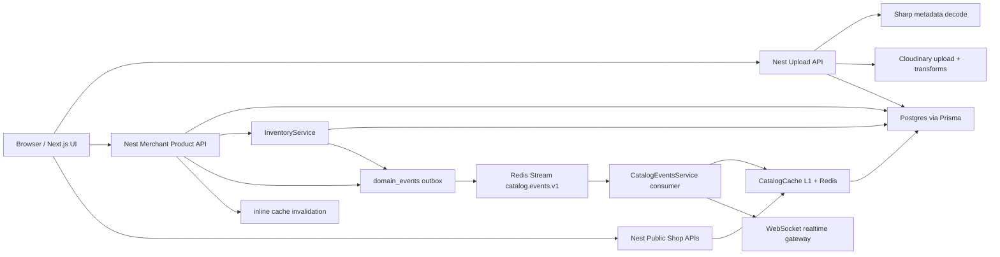

## Phase 2 - Product Model Audit

### What Product and Variant Mean Today

Current Product is both a merchandising entity and a fallback purchasable entity. `products` stores display fields (`name`, `description`, category/SEO), but also source-like purchasable fields (`sku`, `price`, `compare_at_price`, `stock`, measurement, `price_per_base_unit`, `image_url`).

Current Variant is also a purchasable entity. `product_variants` stores `name`, `sku`, `price`, `mrp`, `cost_price`, stock counters, measurement, default flag, archive state, cart/order/inventory relations.

Why both exist today:

- The product form has a base product row plus additional variant rows.
- Public catalog cards need a default price/image quickly.
- Legacy products needed product-level stock/price before full variant modeling existed.
- Sparse product patch syncs scalar product fields into the default variant.
- Product retrieval maps default variant values back to product-level response fields.

This is an anti-pattern at marketplace scale. Product-level `price`, `stock`, `sku`, and inventory should not be authoritative. They should be either removed or maintained only as denormalized read-model fields generated from variants.

### Product Model Verdict

- Product should remain separate from Variant.
- Product should be a merchandising aggregate: title, descriptions, taxonomy, publish state, brand/store ownership, SEO, merchandising media, audit/catalog version.
- Variant/SKU should be the only purchasable entity: price, compare-at price, cost, tax class, SKU/barcode, measurement, pack, inventory, purchasability, lifecycle.
- Product should not contain authoritative inventory.
- Product should not contain authoritative price.
- Product may contain denormalized `min_price`, `max_price`, `default_variant_id`, `primary_media_id`, and `availability_summary` in a read model, not in the source-of-truth table.

### Current Product/Variant Ceiling

| Scale | Current ceiling estimate | Why |
|---|---:|---|
| 1M products | Achievable with Redis, Postgres indexes, careful tenants | Cache hit paths hide live query cost. |
| 10M products | Painful but possible with partitioning and search replacement | Counts, facets, Postgres contains search, and hot store indexes start hurting. |
| 100M products | Not viable | Product joins, facet groupBy, cache invalidation fanout, no product documents, no search engine, no catalog partitioning. |
| 500M variants | Not viable | Variant list embedded in PDP response and live variant joins are not designed for extreme variant cardinality. |

## Phase 3 - Variant Architecture Review

### Current Lifecycle

Current full update flow in `ProductsService.update`:

1. Lock product row with `SELECT ... FOR UPDATE`.
2. Normalize incoming variants through `normalizedVariants`.
3. Convert to DB rows with `productVariantCreateData`.
4. `syncProductVariants` loads existing variants.
5. Existing incoming IDs update in place.
6. New rows insert.
7. Missing active variants archive.
8. Archive cascade updates carts, reservations, stock mirrors, inventory ledger, and summary.

This is a major improvement over delete-and-recreate. Variant IDs are now closer to permanent business identifiers. The remaining flaw is that variant option semantics are still string-based. There is no `product_options`, `product_option_values`, or `variant_option_values`, so the system cannot reliably represent "Color = Red, Size = 42" as data. It can only infer from variant name and measurement fields.

### Variant Rules for Target Architecture

- Variants must never be hard-deleted once referenced.
- Variant IDs must be immutable forever.
- Variant recreation for an existing business SKU is prohibited.
- Variant archive means no longer purchasable, not removed from history.
- Order line references must remain untouched.
- Cart references should surface unavailable state.
- Inventory rows remain auditable and are zeroed/released through ledger entries.
- Variant images should be independent assignments to media entities, not hidden behind product images.

### Ideal Variant Design

Variant is a SKU-level aggregate:

- `variant_id`: stable ULID/UUID.
- `product_id`: merchandising parent.
- `sku_code`: tenant-scoped optional merchant SKU.
- `option_hash`: deterministic hash of option value IDs.
- `status`: DRAFT, ACTIVE, ARCHIVED, SUSPENDED.
- `purchasable_status`: AVAILABLE, OUT_OF_STOCK, COMPLIANCE_BLOCKED, RETIRED.
- Price and measurement live here or in a price book keyed by variant.
- Inventory owns sellable quantity; variant stores no authoritative stock.
- Media assignment is `variant_media(product_variant_id, media_asset_id, role, sort_order)`.

## Phase 4 - Product Upload Architecture

### Current End-to-End Flow

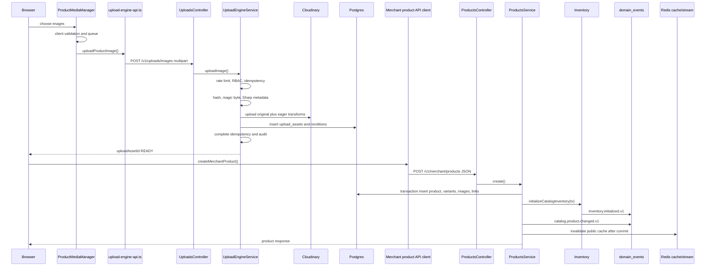

### Can Upload Complete Under 20ms?

No. Not with the current design.

Estimated current image upload latency:

| Stage | Estimate | Reason |
|---|---:|---|
| Browser to Nest upload network | 100ms to seconds | Full file crosses API process. |
| Multer memory buffering | 5ms to 200ms | Depends on file size and Node pressure. |
| SHA-256 source hash | 5ms to 80ms | Server hashes full buffer. |
| Magic byte sniff | under 5ms | Cheap. |
| Sharp metadata decode | 10ms to 300ms | Format and dimensions dependent. |
| Cloudinary upload | 300ms to 30s | Network and provider transform path dominates. |
| DB insert | 5ms to 30ms | Small transaction. |
| Idempotency/audit | 5ms to 30ms | Redis/DB dependent. |

Estimated current product save latency:

| Stage | Estimate | Reason |
|---|---:|---|
| DTO validation/RBAC/category | 5ms to 30ms | Mostly DB/category cache. |
| Product graph CTE write | 10ms to 80ms | Good batched insert, grows with images/variants. |
| Inventory initialization | 10ms to 100ms | Ledger and inventory rows per variant. |
| Audit/outbox | 5ms to 30ms | Transactional insert. |
| Cache invalidation | 5ms to 50ms | Redis and frontend revalidate. |

World-class upload cannot wait for provider transforms, image decode, or DB graph writes on the critical browser upload path. It must become direct-to-object-store plus asynchronous processing.

## Phase 5 - Database Architecture Review

| Table | Why it exists | Why it should not exist in current form | Normalization | Scalability | Indexing | Decision |
|---|---|---|---:|---:|---:|---|
| `products` | Merchandising parent, public product, SEO/category/status. | Contains authoritative-looking price, stock, SKU, measurement, image URL. | 5/10 | 5/10 | 7/10 | Keep but strip purchasable fields from source of truth. |
| `product_variants` | Purchasable row and default variant. | Also stores stock mirrors and string-only option identity. | 6/10 | 6/10 | 7/10 | Keep as SKU table, split options/pricing/inventory. |
| `product_images` | Product media attachment. | `upload_asset_id` unique prevents reuse; variant galleries are indirect. | 6/10 | 6/10 | 6/10 | Replace with product_media and variant_media projections over media_asset. |
| `product_image_variants` | Many-to-many variant media assignment. | No role/sort per variant gallery; depends on product image ownership. | 6/10 | 5/10 | 6/10 | Replace with `variant_media`. |
| `upload_assets` | Uploaded media metadata and lifecycle. | Upload and media asset concepts are mixed; moderation auto-approval is not real moderation. | 6/10 | 6/10 | 7/10 | Split into upload_session, media_asset, media_moderation. |
| `upload_asset_renditions` | Rendition URL metadata. | Provider-specific rendition records are tied to upload asset, not durable media asset. | 7/10 | 7/10 | 7/10 | Keep concept under `media_renditions`. |
| `inventory_items` | Authoritative per-variant per-location counters. | Strong table; should not be merged. | 8/10 | 7/10 | 8/10 | Keep, partition/hash by tenant/location at scale. |
| `variant_inventory_summary` | Read model for variant availability. | Good read model, but updated synchronously and only in Postgres. | 8/10 | 7/10 | 8/10 | Keep as DB projection, add Redis/edge projection. |
| `inventory_reservations` | Checkout reservation state. | Strong table, needs partition/TTL strategy. | 8/10 | 7/10 | 8/10 | Keep. |
| `inventory_ledger` | Immutable stock movement audit. | Strong concept. Default partition is not enough. | 9/10 | 7/10 | 8/10 | Keep, monthly partitions plus archival. |
| `inventory_operations` | Idempotent operation claims. | Good local idempotency, needs retention. | 8/10 | 7/10 | 7/10 | Keep. |
| `domain_events` | Transactional outbox. | Good local source, not sufficient as event bus. | 8/10 | 6/10 | 7/10 | Keep as source of truth, relay to Kafka/EventBridge. |
| `idempotency_keys` | Idempotent upload/product operations. | Good. Needs operation-scoped retention and metrics. | 8/10 | 7/10 | 7/10 | Keep. |
| `cart_items` | Persistent cart rows. | Variant optionality is legacy debt; cart must always reference SKU/variant. | 6/10 | 6/10 | 6/10 | Require variant ID; keep availability state. |
| `order_items` | Immutable order line snapshot. | Correct concept. Variant optionality should be removed for new rows. | 8/10 | 7/10 | 6/10 | Keep immutable snapshots. |
| `categories` | Simple taxonomy. | Too flat for large marketplace taxonomy, facets, regional browse trees. | 5/10 | 5/10 | 6/10 | Replace with taxonomy service/tables. |
| `stores` and tenant tables | Shop ownership and public route scope. | Store routing is fine, but catalog partitioning by store is not implemented. | 7/10 | 6/10 | 7/10 | Keep tenant root; partition catalog by tenant. |

### Current Database ERD

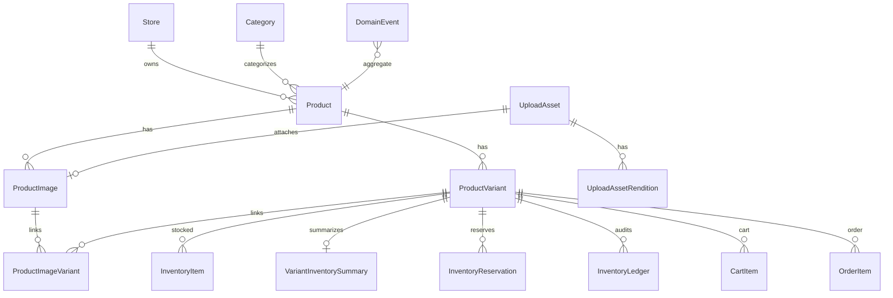

## Phase 6 - Design The Ideal Catalog Model

### First Principles

Product is not what a customer buys. Variant/SKU is what a customer buys. Product is a merchandising container. Media is not product-owned binary data. Inventory is not catalog data. Search is not the source of truth. Cache is not the source of truth.

### Recommended Source Schema

```sql
CREATE TABLE catalog_products (
  product_id uuid PRIMARY KEY,
  store_id uuid NOT NULL,
  title text NOT NULL,
  slug text NOT NULL,
  description text,
  seo_title text,
  seo_description text,
  taxonomy_node_id uuid,
  brand_id uuid,
  status text NOT NULL CHECK (status IN ('DRAFT','PUBLISHED','PAUSED','ARCHIVED')),
  default_variant_id uuid,
  catalog_version bigint NOT NULL DEFAULT 1,
  created_at timestamptz NOT NULL DEFAULT now(),
  updated_at timestamptz NOT NULL DEFAULT now()
);

CREATE TABLE catalog_variants (
  variant_id uuid PRIMARY KEY,
  product_id uuid NOT NULL REFERENCES catalog_products(product_id),
  store_id uuid NOT NULL,
  sku text,
  barcode text,
  title text NOT NULL,
  status text NOT NULL CHECK (status IN ('DRAFT','ACTIVE','ARCHIVED','SUSPENDED')),
  position integer NOT NULL DEFAULT 0,
  option_hash text NOT NULL,
  measurement jsonb NOT NULL,
  created_at timestamptz NOT NULL DEFAULT now(),
  updated_at timestamptz NOT NULL DEFAULT now(),
  archived_at timestamptz,
  UNIQUE (store_id, sku),
  UNIQUE (product_id, option_hash)
);

CREATE TABLE product_options (
  option_id uuid PRIMARY KEY,
  product_id uuid NOT NULL REFERENCES catalog_products(product_id),
  name text NOT NULL,
  position integer NOT NULL,
  UNIQUE(product_id, lower(name))
);

CREATE TABLE product_option_values (
  option_value_id uuid PRIMARY KEY,
  option_id uuid NOT NULL REFERENCES product_options(option_id),
  value text NOT NULL,
  normalized_value text NOT NULL,
  swatch jsonb,
  position integer NOT NULL,
  UNIQUE(option_id, normalized_value)
);

CREATE TABLE variant_option_values (
  variant_id uuid NOT NULL REFERENCES catalog_variants(variant_id),
  option_value_id uuid NOT NULL REFERENCES product_option_values(option_value_id),
  PRIMARY KEY (variant_id, option_value_id)
);

CREATE TABLE variant_prices (
  variant_id uuid NOT NULL REFERENCES catalog_variants(variant_id),
  price_book_id uuid NOT NULL,
  currency char(3) NOT NULL,
  price_minor bigint NOT NULL,
  compare_at_minor bigint,
  cost_minor bigint,
  effective_from timestamptz NOT NULL DEFAULT now(),
  effective_to timestamptz,
  PRIMARY KEY (variant_id, price_book_id, effective_from)
);

CREATE TABLE media_assets (
  media_asset_id uuid PRIMARY KEY,
  owner_store_id uuid NOT NULL,
  provider text NOT NULL,
  provider_asset_id text NOT NULL,
  original_url text NOT NULL,
  status text NOT NULL CHECK (status IN ('UPLOADING','PROCESSING','READY','REJECTED','DELETED')),
  moderation_status text NOT NULL CHECK (moderation_status IN ('PENDING','APPROVED','REJECTED','NEEDS_REVIEW')),
  sha256 text,
  width integer,
  height integer,
  bytes integer,
  created_at timestamptz NOT NULL DEFAULT now(),
  UNIQUE(provider, provider_asset_id)
);

CREATE TABLE media_renditions (
  media_asset_id uuid NOT NULL REFERENCES media_assets(media_asset_id),
  kind text NOT NULL,
  url text NOT NULL,
  width integer NOT NULL,
  height integer NOT NULL,
  format text NOT NULL,
  bytes integer,
  PRIMARY KEY(media_asset_id, kind)
);

CREATE TABLE product_media (
  product_id uuid NOT NULL REFERENCES catalog_products(product_id),
  media_asset_id uuid NOT NULL REFERENCES media_assets(media_asset_id),
  role text NOT NULL,
  sort_order integer NOT NULL,
  PRIMARY KEY(product_id, media_asset_id, role)
);

CREATE TABLE variant_media (
  variant_id uuid NOT NULL REFERENCES catalog_variants(variant_id),
  media_asset_id uuid NOT NULL REFERENCES media_assets(media_asset_id),
  role text NOT NULL,
  sort_order integer NOT NULL,
  PRIMARY KEY(variant_id, media_asset_id, role)
);

CREATE TABLE product_documents (
  product_id uuid PRIMARY KEY,
  store_id uuid NOT NULL,
  catalog_version bigint NOT NULL,
  document jsonb NOT NULL,
  updated_at timestamptz NOT NULL DEFAULT now()
);
```

Partitioning defaults:

- Hash partition `catalog_products`, `catalog_variants`, `product_documents` by `store_id` after 10M products.
- Range partition `domain_events`, `inventory_ledger`, `audit_logs`, `search_index_jobs` by month from day one.
- Keep `variant_prices` append-friendly and partition by `effective_from` if historical price volume is high.

### Recommended ERD

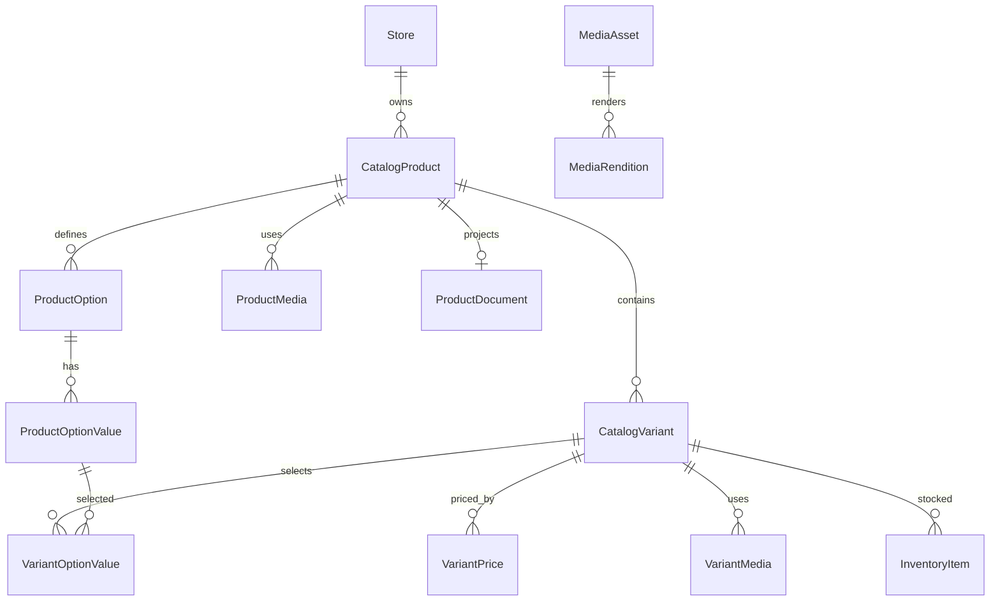

## Phase 7 - Design The Ideal Upload System

### Target Upload Architecture

Uploads should not go through backend data plane. The backend should authorize an upload session, sign a provider request, and commit metadata after provider upload.

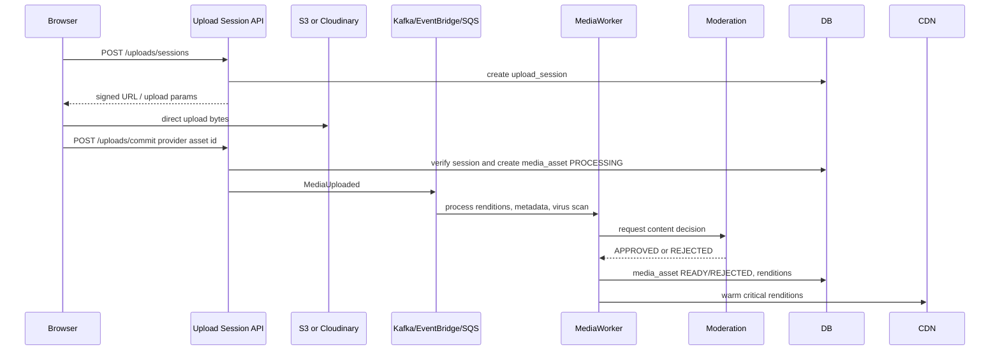

Key decisions:

- Direct upload to Cloudinary or S3. If Cloudinary remains, use signed direct upload presets. If cloud-agnostic, use S3 multipart plus image worker.
- Processing is asynchronous.
- Media can be attached to drafts while `PENDING`; published products require `READY + APPROVED`.
- Store upload sessions with `session_id`, `store_id`, `user_id`, `purpose`, `status`, `expires_at`, `provider`, `policy_snapshot`, and `idempotency_key`.
- Separate `media_asset` from `upload_session`. Upload is an action; media asset is durable catalog content.
- Moderation state is explicit and evented. Auto-approval is acceptable only as a temporary consumer implementation, not as schema design.

AWS mapping:

- S3 multipart upload for originals.
- CloudFront for delivery.
- Lambda/ECS/Fargate worker for Sharp/libvips transforms.
- Rekognition or third-party moderation consumer.
- EventBridge or SQS for media processing jobs.
- DynamoDB or Postgres for upload session claims.

## Phase 8 - Design The Ideal Retrieval Architecture

### Target Retrieval Flow

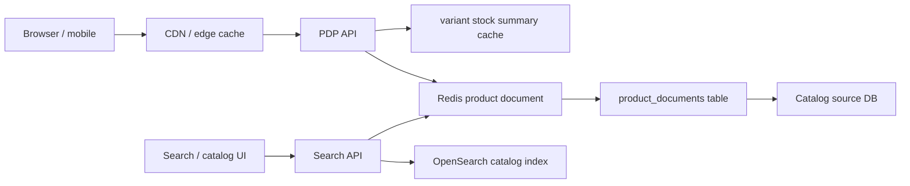

Requirements:

- PDP under 50ms: serve a denormalized product document by `product_public_id` from edge/Redis. DB is fallback only.
- Catalog page under 50ms: query OpenSearch for IDs/facets, hydrate from Redis product card documents.
- Search under 100ms: OpenSearch/Elasticsearch with tenant filters, category facets, variant price/availability ranges, typo tolerance/autocomplete.
- Variant lookup under 10ms: product document contains variant matrix and option value map for normal products. Extreme variant products page variants separately by option prefix.

Read model shape:

```json
{
  "productId": "uuid",
  "storeId": "uuid",
  "version": 123,
  "title": "Sunflower oil",
  "status": "PUBLISHED",
  "defaultVariantId": "uuid",
  "priceRange": {"min": 17500, "max": 30000, "currency": "INR"},
  "media": [],
  "options": [{"name": "Unit", "values": ["1L", "500ml"]}],
  "variants": [
    {"variantId": "uuid", "optionValueIds": [], "priceMinor": 17500, "inStock": true, "mediaIds": []}
  ],
  "stockSummaryVersion": 44
}
```

## Phase 9 - Design The Ideal Inventory Architecture

Inventory source of truth should be `inventory_items` plus `inventory_ledger`, keyed by `(store_id, variant_id, location_id)`. Variant and Product should not contain stock counters.

Recommended flow:

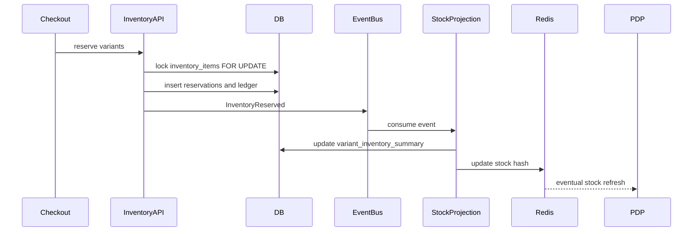

Design rules:

- Reservation and counter mutation must be strongly consistent in the inventory DB.
- Public stock display can be eventually consistent with explicit staleness SLO.
- Checkout availability must always read/lock inventory source, not public cache.
- Ledger is append-only and partitioned monthly.
- Reconciliation compares `inventory_items` to ledger-derived expected counters.
- Multi-location support is first class; default store location is just one location.
- Multi-region active-active inventory requires regional ownership or escrow. Do not pretend global stock counters can be strongly consistent under 50ms without constraints.

Recommended SLOs:

- Checkout reservation P99 under 250ms within region.
- Stock projection lag P95 under 2s, P99 under 10s.
- Ledger reconciliation drift alert within 5 minutes.

## Phase 10 - Design The Ideal Event Architecture

Keep `domain_events` as transactional outbox. Replace Redis Stream as the durable business bus for catalog/inventory/search with Kafka, EventBridge+SQS, or equivalent.

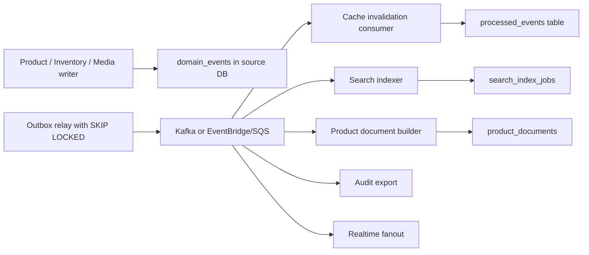

Core event contracts:

- `ProductCreated`: product identity, store, catalog version, status, changed fields.
- `ProductUpdated`: product identity, previous/next version, changed fields.
- `VariantCreated`: product, variant, option values, status.
- `VariantUpdated`: variant, changed fields, version.
- `VariantArchived`: variant, archived reason, affected cart policy.
- `InventoryChanged`: variant, location, counters, stock version, ledger ID.
- `MediaAttached`: product/variant, media asset, role, version.
- `MediaRemoved`: attachment identity, version.
- `SearchIndexed`: product, catalog version, index name.
- `CacheInvalidated`: scopes, source event ID.

Consumer requirements:

- Delivery is at least once.
- Every consumer must be idempotent by `event_id` and must ignore stale `catalog_version`.
- Maintain `processed_events(consumer_name, event_id, processed_at, catalog_version)`.
- Dead letter after bounded retries with alerting.
- Replay by event type, aggregate ID, time range, or consumer group.

AWS mapping:

- Outbox relay: ECS service or Lambda with RDS/Aurora connection.
- Event bus: MSK for Kafka semantics, or EventBridge to SQS FIFO/standard queues by consumer.
- DLQ: SQS dead-letter queues plus alarms.
- Replay: archived event log in S3 and outbox re-drive tooling.

## Phase 11 - Design The Ideal Search Architecture

Current search is Postgres `contains` across product name, description, category, subCategory, productType. This is not viable.

Technology decision:

| Option | Verdict |
|---|---|
| Postgres B-tree | Not usable for arbitrary contains/facets. |
| Postgres full text + trigram | Good interim for small scale, not 100M/500M marketplace search. |
| Typesense | Good developer experience, weaker for very large complex marketplace facets. |
| Algolia | Excellent managed search but high cost and less source-control over complex stock/ranking pipelines. |
| OpenSearch/Elasticsearch | Best fit for self-controlled, high-scale marketplace search with facets, ranking, geo, autocomplete. |

Recommended index model:

- One product document per published product for PDP/catalog cards.
- Nested variants for normal variant counts.
- Separate variant index for high-cardinality variant search and SKU/admin search.
- Fields: store ID, product ID, product title, normalized text, category path, option values, brand, price range, in-stock, geo/store delivery eligibility, updated version.
- Inventory-aware search uses projected stock state, not live inventory locks.
- Index writes are driven by `search_index_jobs`, claimed with `FOR UPDATE SKIP LOCKED`, retried with backoff, dead-lettered after max attempts.

Search SLO:

- Search API P95 under 100ms, P99 under 250ms for common queries.
- Product update searchable P95 under 30s, P99 under 2m.
- Index lag alert at 5 minutes.

## Phase 12 - Final Architecture Review

### Recommended Architecture Diagram

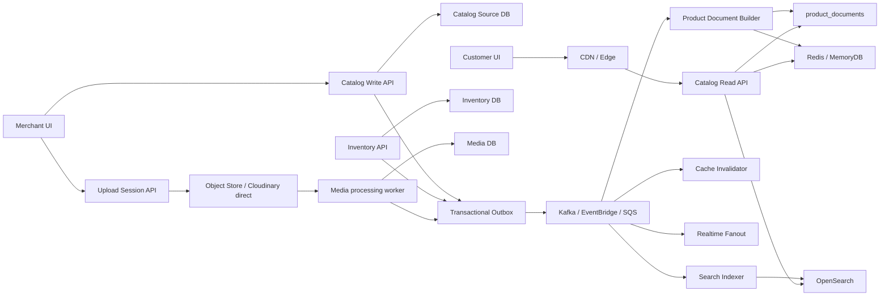

### Current Upload Flow

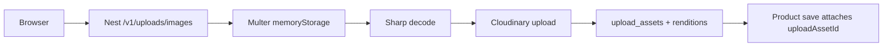

### Recommended Upload Flow

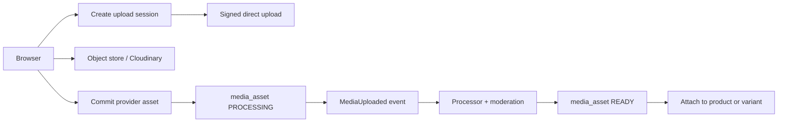

### Current Retrieval Flow

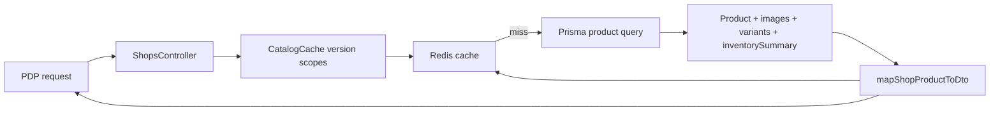

### Recommended Retrieval Flow

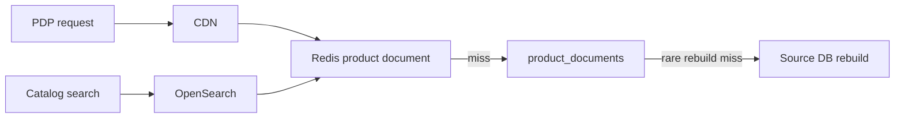

### Current Inventory Flow

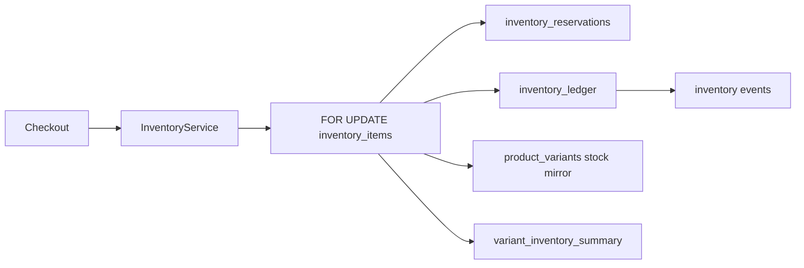

### Recommended Inventory Flow

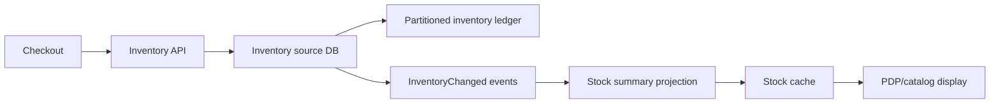

### Current Event Flow

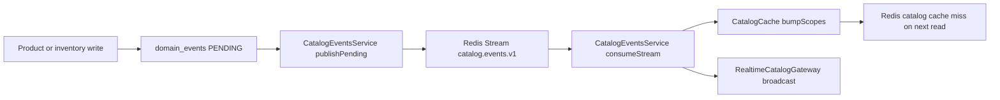

### Recommended Event Flow

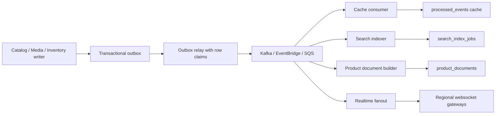

## Phase 13 - Migration Strategy and Brutal Review

### Priority Order

1. Freeze domain rules: Variant/SKU is the only purchasable entity. Product source table stops being inventory/price authority.
2. Add normalized option model while preserving current variant names.
3. Add product/variant media tables over independent `media_assets`.
4. Add product document read model and build from current source tables.
5. Add OpenSearch index and `search_index_jobs`; shadow search results against Postgres.
6. Move upload path to direct signed upload sessions and async media processing.
7. Move catalog and inventory consumers from Redis Streams to durable bus.
8. Stop public reads from live Prisma graph joins.
9. Backfill and then remove product-level source usage for stock/price/SKU from write flows.
10. Partition high-cardinality tables and automate future partitions.

### Zero-Downtime Migration Plan

| Step | Action | Rollback |
|---|---|---|
| 1 | Add new tables: options, option values, media assets, product/variant media, product documents, search jobs. | Tables are additive; disable writers. |
| 2 | Backfill product-backed default variants and option rows from current variants. | Re-run idempotent backfill; old reads unchanged. |
| 3 | Dual-write product/variant/media changes to old tables and new source tables. | Turn off dual-write flag. |
| 4 | Build product documents from source tables and compare to current PDP DTOs. | Keep current public APIs on old mapper. |
| 5 | Introduce Redis product document cache and read-through fallback. | Feature flag back to `ShopsService` live query. |
| 6 | Stand up OpenSearch index with shadow queries and diff logging. | Keep Postgres search as active path. |
| 7 | Route search/facets to OpenSearch for low-risk stores, then expand. | Store-level feature flag rollback. |
| 8 | Introduce direct upload sessions while keeping `/v1/uploads/images` fallback. | Disable session endpoint; clients use old endpoint. |
| 9 | Move event relay to durable bus with duplicate consumers in shadow. | Continue Redis Streams consumer. |
| 10 | Cut public PDP/catalog to read models. | Per-route flag back to cached live query. |
| 11 | Deprecate product-level source price/stock usage. | Keep fields as denormalized mirrors until confidence high. |

### Final Brutal Assessment

The current implementation is not careless. It is the natural result of evolving a commerce system from product CRUD into a marketplace catalog. The team has already fixed several dangerous defects: idempotent creation, variant archive, product-row locking, moderation status, primary image uniqueness, inventory summary, and ledger-backed stock.

The architecture still needs a principled split:

- Catalog write model: source of product and variant truth.
- Media platform: independent upload/session/asset/moderation/rendition lifecycle.
- Inventory engine: source of sellable stock truth.
- Event platform: durable delivery, replay, DLQ, idempotent consumers.
- Read platform: product documents, Redis/edge cache, OpenSearch.

Do not try to tune Postgres `contains` search, bigger Redis TTLs, or more Prisma `select` slimming into a 100M product platform. Those are short-term optimizations. The correct target is source/write separation from query/read models, variant as immutable SKU, and event-driven projections.
